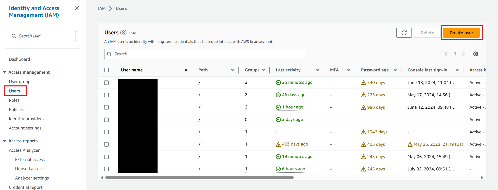
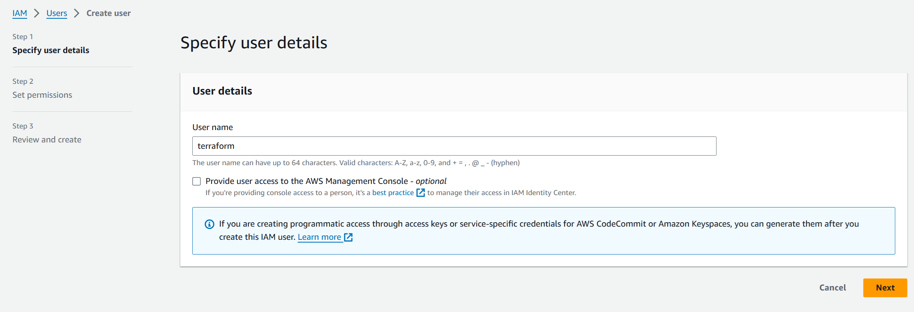
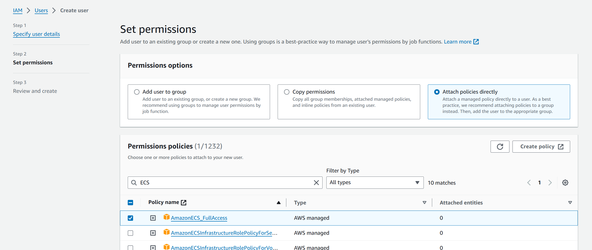

# Deploy a container instance in Amazon ECS using the Terraform

Amazon Elastic Container Service (Amazon ECS) is a fully managed container orchestration service that helps you to more efficiently deploy, manage, and scale containerized applications.

## Prerequisites

- [AWS CLI](https://docs.aws.amazon.com/cli/latest/userguide/getting-started-install.html)

## Setting Up AWS IAM Deployer User Account

To provision the infrastructure running on AWS ECS, you need an Identity and Access Management (IAM) user account.

On AWS management console navigate to IAM > Access management > select Users > then select **Create user**.



On **Specify user details** step, enter following values for **User name**.

- User name: `terraform`



On **Set permissions** step, attach policies directly to user including **AmazonECS_FullAccess**, **ElasticLoadBalancingFullAccess**, **AmazonEC2FullAccess**, and **IAMFullAccess**.



Leave the other values as their defaults, the select **Create user**.

After user created navigate into user and create **Access key**. This will create a user access key ID and a secret access key. Copy these credentials and configure them to your installed AWS CLI as follows.

Launch your command line and run the following command:

```bash
aws configure
```

Provide your AWS IAM user details:

- AWS Access Key ID
- AWS Secret Access Key
- Default region name: For example, us-east-1
- Default output format: json

## Configuring Terraform Variables and Secrets

Before applying your Terraform configuration, it's essential to set up your variables and secrets correctly. Terraform allows you to define variables in `.tfvars` files, which can be particularly useful for managing sensitive information securely.

### Step 1: Modify Variables

First, review and modify the Terraform variables defined in your `variables.tf` file. These variables can include configurations such as the **AWS region**, **ECS cluster name**, and any other parameters relevant to your infrastructure.

- `aws_region`: The AWS region where your resources will be deployed. Default is `us-east-1`. Change as needed to match your deployment target.
- `container_cpu`: The amount of CPU units to allocate for each container. For example, `256` for 0.25 vCPU.
- `container_memory`: The amount of memory (in MiB) to allocate for each container. For example, `512` for 512MiB.
- `container_allowed_origins`: A list of origins allowed to access the resources, for CORS configuration. For example, `["https://example.com"]`.
- `service_desired_count`: The desired number of instances of your application to run. For example, `3` for high availability.

Above is recommended to change but not required.

### Step 2: Create `secret.tfvars` for Sensitive Information

For sensitive information such as AWS access keys, it's recommended to use a separate `secret.tfvars` file.

Create a file named `secret.tfvars` in the same directory as your Terraform configuration files and add your sensitive variables there:

```hcl
license_key           = "YOUR_LICENSE_KEY"
```

## Running Terraform Commands

## Initialize Terraform

Run `terraform init` to initialize the Terraform deployment. This command prepares your working directory for other commands, downloads the AWS provider required to manage your AWS resources, and ensures you have the latest version of the provider.

```Console
terraform init -upgrade
```

## Create a Terraform execution plan

Run [terraform plan](https://www.terraform.io/docs/commands/plan.html) to create an execution plan. This step is crucial as it allows you to review what Terraform will do before making any changes to your AWS infrastructure.

```Console
terraform plan -var-file="secret.tfvars" -out main.tfplan
```

## Apply a Terraform execution plan

Run [terraform apply](https://www.terraform.io/docs/commands/apply.html) to apply the execution plan to your cloud infrastructure.

```Console
terraform apply main.tfplan
```

## Verify the results

1. **Check the Application URL**: After applying the execution plan, Terraform outputs the `app_url`. To display the `app_url` again, you can use the `terraform output` command:

    ```Console
    terraform output -raw app_url
    ```

2. **Validate the Deployment**: Use `curl` or Postman to send a request to your application to ensure it's responding correctly. The example below uses `curl` to ping your application's health check endpoint, which should return `pong` if the application is running correctly.

    ```bash
    curl http://<app_url>/v1/document-services/ping
    ```

    or use FQDN

    ```bash
    curl http://<app_url>/v1/document-services/ping
    ```

## Troubleshooting

### Issue: Role with name ecsTaskExecutionRole already exists

If you encounter the error indicating that the IAM Role `ecsTaskExecutionRole` already exists, it means Terraform is attempting to create a role that is already present in your AWS account. This can happen if the role was created outside of Terraform or in a previous Terraform run that is not currently reflected in your state file.

To resolve this issue, you have two options:

1. **Import the Existing Role into Terraform**: If you want to manage the existing role with Terraform, you can import it into your Terraform state. This tells Terraform to manage the existing role. Run the following command:

    ```bash
    terraform import -var-file="secret.tfvars" aws_iam_role.ecsTaskExecutionRole ecsTaskExecutionRole
    ```

    Replace `ecsTaskExecutionRole` with the actual name of the IAM role if it is different. After importing, Terraform will manage the existing role as part of your Terraform configuration.

2. **Use a Different Role Name**: If the role is not needed or you prefer to create a new role, modify your Terraform configuration to use a different role name. Ensure that the new role name is updated wherever it is referenced in your Terraform configuration.

After resolving the issue by either importing the role or using a different name, run `terraform apply` again to proceed with your infrastructure provisioning.
